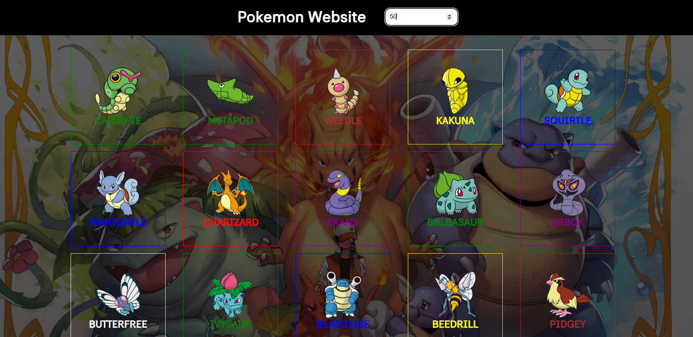

# PokeApi

## Description

Educational website for interacturing with an API and MockAPI

### Platform Description

- section 1: Title
- section 2: Input for Filter the Pokemon by cuantity
- section 3: Show the Cards

### How to used

The webside can show the cards for name and limit of them. For search by name, you just have to write the pokemon's name and for search by limit, you just have to enter the number on the input and it is going to be the number from 0 to the number.

## Relevant Technologies

HTML / CSS / JavaScript
Text Editor: Visual Studio Code

## User Interface Design

### Color Palette
Primiry Color > #f4dc26f3
Font Color > depend on pokemon's color palette


### Typography
fontFamily: "Inclusive Sans", sans-serif;


## Design
<h4>Home Page</h4>
<p>You can enjo my website and feel free to play with. </p>
<div align="center"></div>

<h4>Filter by Limit</h4>
<p>The filter view. One of the filters works by number. You enter a number and It's going to show the pokemons from 0 until the number.</p>
<div align="center"></div>

<h4>Card</h4>
<p>The card is going to play it, feel free to move the radio input and put or take off exp for the pokemon</p>
<div align="center"></div>


### Recomendaciones

<ol>
    <li>You must have Node.js installed</li>
    <li>the package.json must be installed, with the command:
     
      --npm init -y--

</li>
<li>
    Add the modulization in the .json file: 
      
      "main": "main.js",
       "type": "module"

</li>
    <li>Install the npm package manager (Node Package Manager) to install the json-server package in your project and create the node_modules file.

    npm -E -D i json-server
    
<ul>
    <li> -e : download the stable version</li>
    <li>-d: is a dependency outside of node</li>
     <li>the i o install: This indicates that you are running the npm install command.</li>
    <li> the json-server: dependency to install</li>
</ul>
    </li>
    <li>You can also configure the command and port, inside "scripts" in the package.json folder

    "dev": "json-server --watch ./db/db.json --port 5414 --host 127.0.54.1"
    
This configuration we can enter the url <b>http://127.0.54.1:5414</b> </li>
    <li>Create the structure within the .json, for example:

```javascript
    {
    "pokemons": 
    [
        {
            "name": "bulbasaur",
            "especificaciones": [
                {
                "name": "hp",
                "base": 45
                },
                {
                "name": "attack",
                "base": 49
                },
                {
                "name": "defense",
                "base": 49
                },
                {
                "name": "special-attack",
                "base": 65
                },
                {
                "name": "special-defense",
                "base": 65
                },
                {
                "name": "speed",
                "base": 45
                }
            ],
            "id": 1
        }
    ]
    }
```

</li>
    <li>6. To run the json-server with the command:
    
    npm run dev

</li>
</ol>


### Urls- url = https://pokeapi.co/api/v2/pokemon
- urlApi = https://pokeapi.co/api/v2/pokemon?limit=
- urlJsonServer = http://127.0.54.1:5414/pokemons

### Browsers compatible

- Google Chrome
- The others browsers may change the design.
