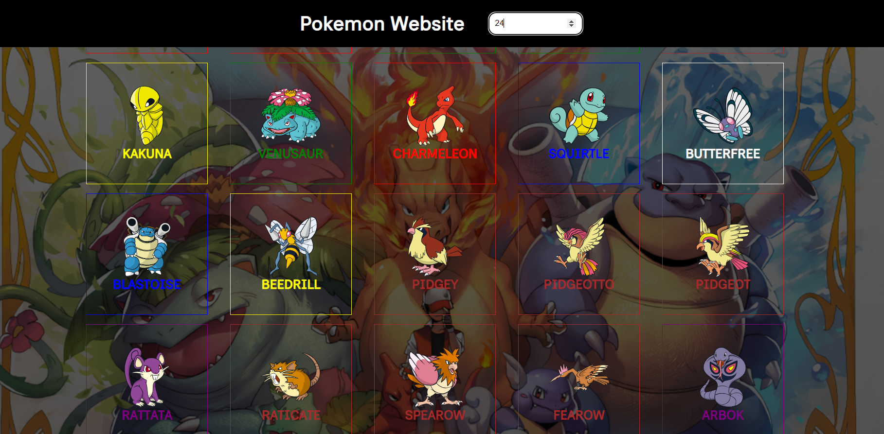
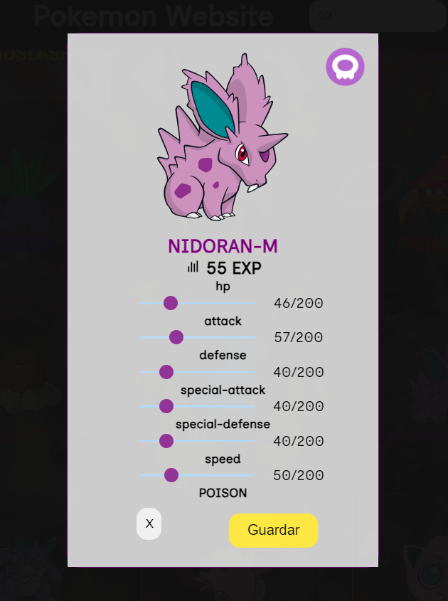

# PokeApi

## Description

Educational website for interacturing with an API and MockAPI

### Platform Description

- section 1: Title
- section 2: Input for Search the pokemon by name
- section 3: Input for Filter the Pokemon by cuantity
- section 4: Show the Cards

### How to used

The webside can show the cards for name and limit of them. For search by name, you just have to write the pokemon's name and for search by limit, you just have to enter the number on the input and it is going to be the number from 0 to the number.

## Relevant Technologies

HTML / CSS / JavaScript
Text Editor: Visual Studio Code

## User Interface Design

### Color Palette
Primiry Color > #f4dc26f3
Font Color > depend on pokemon's color palette

### Typography
fontFamily: "Inclusive Sans", sans-serif;

## Design
<h4>Home Page</h4>

You can enjo my website and feel free to play with. 

<h4>Filter by Limit</h4>

The filter view. One of the filters works by number. You enter a number and It's going to show the pokemons from 0 until the number.

<h4>Filter by Name</h4>

Another way to filter the searching mode is by name. Be free, you will going to see whatever pokemon with some of letters.

<h4>Card</h4>

The card is going to play it, feel free to move the radio and put or take off exp for the pokemon

### Urls- url = https://pokeapi.co/api/v2/pokemon
- urlApi = https://pokeapi.co/api/v2/pokemon?limit=
- urlMockapi = https://6509ed8cf6553137159c442b.mockapi.io/pokemonAPI

### Browsers compatible

- Google Chrome
- !be awair for the others browsers
